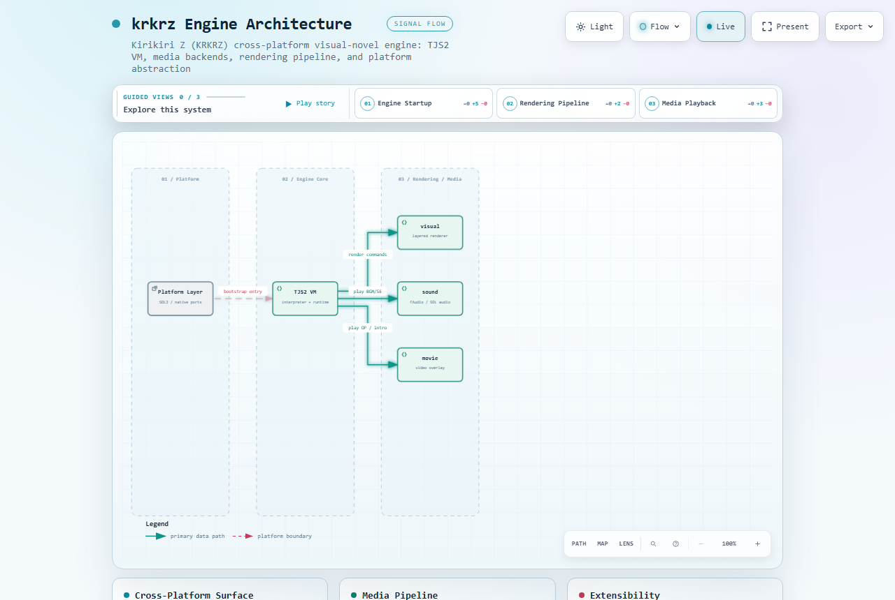

# krkrz（吉里吉里Z / KiriKiri Z）

[English](README.md) | [中文](README_zh.md)

[](LICENSE)

krkrz 是基于 [吉里吉里Z](https://github.com/krkrz/krkrz) 衍生的跨平台视觉小说引擎框架，扩展了 SDL2 运行时，并提供 Android、iOS、OpenHarmony 与桌面平台的原生移植。它包含 TJS2 脚本虚拟机、分层精灵合成器、基于 FAudio 的音频混音与片头影片的叠加层——即发布一套 KAG/Kirikiri 剧本所需完整运行时层。

本仓库是框架本身的干净提取（不含任何游戏专属素材），用于围绕你自己的剧本数据构建独立的视觉小说运行时。

## 模块结构

| 目录          | 用途                                                    |
| ------------- | ------------------------------------------------------- |
| `tjs2`        | TJS2 脚本虚拟机（字节码解释器）                          |
| `base`        | 核心运行时：流、文件系统、线程池、窗口消息                |
| `visual`      | 分层渲染器：图层、精灵、转场、OpenGL/SDL 后端             |
| `sound`       | 音频子系统：FAudio / SDL 音频混音，负责 BGM 与音效         |
| `movie`       | 片头/过场影片的视频叠加层                                |
| `msg`         | 消息/事件泵与环境抽象                                    |
| `extension`   | 原生 TJS2 扩展的插件注册表                                |
| `environ`     | 平台抽象（Win32、SDL2、Android、iOS、OHOS）               |
| `android`     | Android JNI 工程脚手架                                   |
| `utils`       | 文件系统与字符串工具                                     |

## 架构总览



交互式图表由 [`docs/architecture.dataflow.json`](docs/architecture.dataflow.json) 经 Archify 渲染器生成。

## 快速开始

桌面端原始构建步骤见 `HowToBulid.txt`。SDL2 与各原生平台构建由 `base` + `environ` 中的引擎核心驱动；各平台引导代码位于对应 `environ/` 子目录。

## 添加游戏内容（素材与剧本文本）

krkrz 在运行时从 ARC/Xp3 归档或打包的 `data` 目录加载内容。要使角色立绘与剧本文本可被加载，请按下述结构组织游戏内容。

### 1. 内容目录结构

将游戏数据放在可执行文件旁（或原生应用包内），遵循吉里吉里惯例命名：

```
data/
├── scenario/          # KAG 剧本脚本（.ks 文本文件）
├── image/             # 图形：背景、立绘、UI
│   ├── bgm/ ...       # （音频惯例上放在 sound/ 下）
├── sound/             # BGM 与音效（OGG/WAV，经 FAudio）
├── video/             # 片头影片（由 movie 叠加层播放）
├── fnt/               # 字体资源
└── system/            # 系统脚本（init.tjs 等）
```

启动时引擎通过配置的数据源解析 `./data/*`；在 Android/iOS 移植版中，运行时会在虚拟机启动前把已解压的公共数据目录报告给原生桥。

### 2. 添加剧本文本

剧本文本是 `data/scenario/` 下的 UTF-8（旧归档亦可为 Shift-JIS）`.ks` 文件，采用 KAG/KAGEX 语法：

```
; start.ks
*start
Ciallo～(∠・ω< )⌒☆，世界。
@close message
```

场景管理器（base msg 层）将这些行派发给 TJS2 虚拟机；`@` 开头的标签驱动文本输出、背景切换与消息窗状态。

### 3. 添加角色立绘

在 `data/image/<character>/` 下放置立绘（PNG、BMP 或带透明的 JPEG），再由剧本通过 visual 子系统暴露的图层 API 显示：

```
; 在默认位置显示角色立绘
@bg storage="image/room.png"        ; 背景图层
@ld c="image/alf/alf_stand.png"    ; 角色图层
```

视觉渲染器按归档内相对路径加载图片并挂到命名图层；图层顺序、偏移与转场由 `@ld` / `@bg` / `@lt` 标签控制，也可直接操作 `Layer` TJS2 对象。

### 4. 播放音频与片头影片

```
@bgm storage="sound/bgm01.ogg"      ; 在 FAudio 混音器上启动音乐
@movie storage="video/op.mp4"       ; 通过 movie 叠加层播放片头
```

音频子系统在应用切后台/回前台时暂停/恢复，并带短暂稳定延迟，与 iOS/Android 平台生命周期保持一致。

## 平台

- Windows（Win32 / SDL2）
- Android（ARM64-v8a、armeabi-v7a）
- iOS（ARM64）
- OpenHarmony / HarmonyOS
- macOS / Linux（SDL2）

## 许可证

MIT（见 [LICENSE](LICENSE)）。上游吉里吉里Z 同样以 MIT 许可证分发。